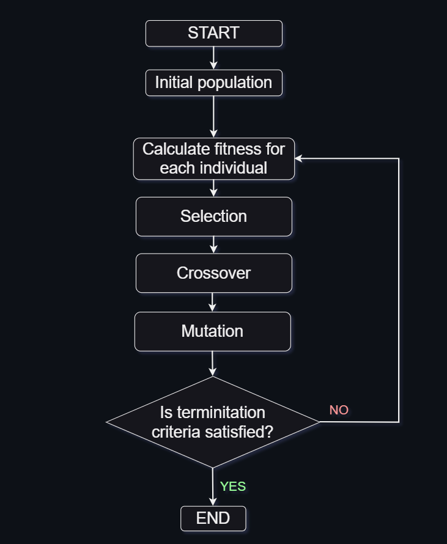
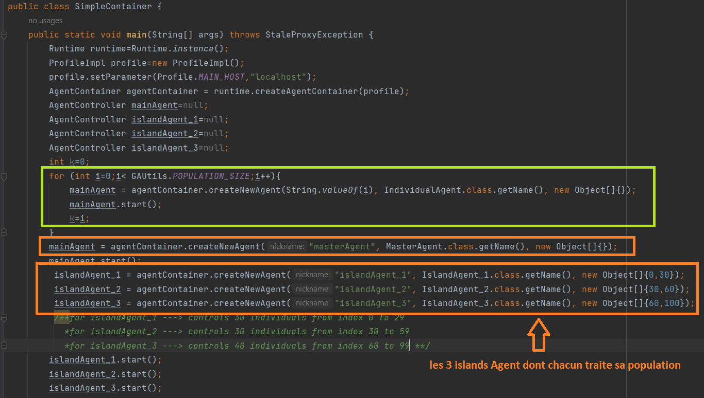
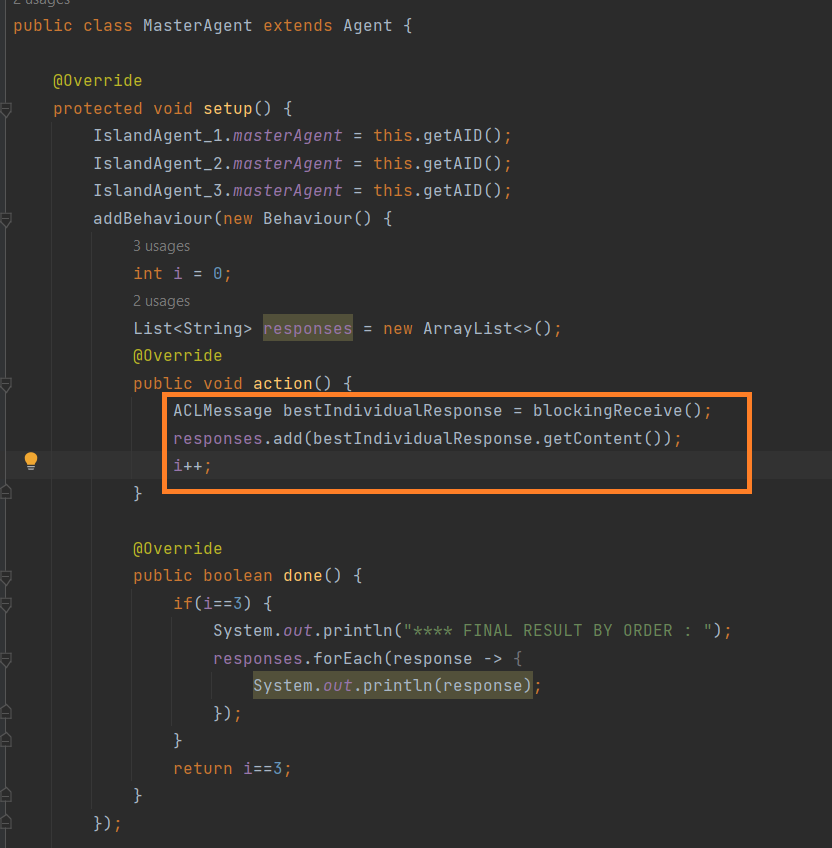
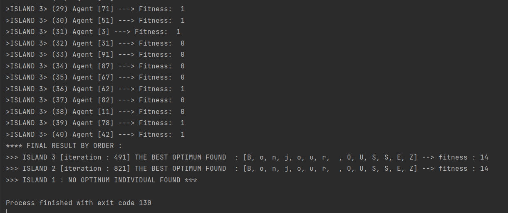

# Distributed genetic algorithms
## 📝 Table of Contents
- [INTRODUCTION](#1-introduction-en-)
  - [Calculating the fitness score](#2--calculating-the-fitness-score)
- [Genetic Algorithm Conception & Implementation](#-genetic-algorithm-idea--implementation)
  - [Partie conception](#3-partie-conception-)
  - [Partie fonctionnement :](#4-partie-fonctionnement-)
    - [Container Class:](#Container-Class)
    - [Agent Class:](#Agent-Class)

- [Partie Execution :](#5-partie-execution-)
- [Update of the project](#6-update)
### 1. INTRODUCTION (EN) 📖
**Parallel genetic algorithm** is such an algorithm that uses multiple genetic algorithms to solve a single task. All these algorithms try to solve the same task and after they’ve completed their job, the best individual of every algorithm is selected, then the best of them is selected, and this is the solution to a problem. This is one of the most popular approach to parallel genetic algorithms, even though there are others. This approach is often called ‘island model’ because populations are isolated from each other, like real-life creature populations may be isolated living on different islands. Image below illustrates that.


### 2.  Calculating the Fitness Score
In our case an individual is a string of characters, and the problem is to find a string that matches a given target string. The fitness score of an individual is calculated by counting the number of characters that didn't match the target string. The higher the fitness score, the better the solution. For example, if the target string is `Hello!` and the individual is `Hello?`, the fitness score will be 5 instead of 6, because the `?` character doesn't match the `!` character.
- The corresponding Java code is:
```java
public class Individual {
    // Chromosome
    private List<Character> genes = new ArrayList<>();
    // Fitness score
    private double fitness;

    public void calculateFitness(String target) {
        // Initialize fitness to chromosome length
        fitness = genes.size();

        for(int i = 0; i < genes.size(); i++)
            if(genes.get(i).equals(target.charAt(i)))
                fitness -= 1;
    }
}
```
### 3. Partie conception : 
Le systeme multi agent de cette application base sur l'achitecture CENTRALISEE comme suit : 

 Il existe 2 type d'agents : 
- Master Agent ( agent qui controle les opérations de genetic algorithm : selection, crossover, mutation, getFitness, get_optimum_individual...)

- individual Agent : il represente un individuel et il applique des opérations demandées par le Master Agent.
### 4. Partie Fonctionnement : 

1) Créer une population avec X individus ( notre cas X = 100 )
2) Distribution de la population sur les 3 islands Agent:
 - islands agent 1 : 30 individus
 - islands agent 2 : 30 individus
 - islands agent 3 : 60 individus 

3) Chaque individual, aura initialisé son chormosome et calculé sa propre fitness qui sera envoyée par la suite à Master Agent

4) Une boucle qui comprent les opérations suivante : 
- a) Selection(selection 2 meilleur agents selon leurs fitness)
- b)  crossOver ( sur les 2 meilleurs agents)
- c) Mutation ( sur les 2 meilleurs agents )
- d) Naissance de 2 nouveaux individual agents 	    
- e) remplacer les 2 faibles Individual Agent par les 2 nouveaux Individual agents 

- d) FIN DE BOUCLE : si il existe un individu agent dont sa fitness est optimel OU le nbr d'itération est atteint

Ci-dessous, un schéma qui résume les opérations de GA : 



l'implementation des opérations se trouve dans le package **islands**

--- 
#### Container Class:
il existe 2 containers class :
 - MainContainer : qui contient les 3 agents principaux par defaut.

 ```java
 public class MainContainer {
    public static void main(String[] args) throws ControllerException {
        Runtime runtime=Runtime.instance();
        ProfileImpl profile=new ProfileImpl();
        profile.setParameter(Profile.GUI,"true");
        AgentContainer mainContainer = runtime.createMainContainer(profile);
        mainContainer.start();
    }
}
```
- SimpleContainer : conteneur qui contient l'agent Master et les agents Islands qui traitent leurs populations.


---
#### Agent Class:
il existe 2 agents class : 
- MasterAgent : c'est le maitre agent qui reçoit les réponses des islands agents.
    - Il attend la réponse de chaque island agent ( 3 island agents) et puis il affiche les réponses en ordre.
    - l'island agent le plus optimal c'est celui qui a trouvé la meilleur valeur fitness dans quelques iterations.


- IndividualAgent : c'est l'agent qui represente un individu , avec son chromosome et sa fitness.

--- 
### 5. Partie Execution 📝 
1. lancer la classe MainContainer
2. lancer la classe SimpleContainer



### 6. Update 

Vous pouvez modifier la valeur optimale de fitness et aussi solution à chercher dans la classe **dictionnary/GAUtils: 
 **NOTE BIEN** : 
- chromosome_size doit etre égale à la longeur de la solution.
- la population maximale = 100 ( au dela va engendrer un erreur)
  
```java
public class GAUtils {

public static final int MAX_IT=2000;
public static final int POPULATION_SIZE=100;
 public static final int CHROMOSOME_SIZE=12;
 public static final int MAX_FITNESS=12;
 public static final String SOLUTION="Bonjour SDIAe";
 public static final String CHARATERS="abcdefghijklmnopqrstuvwxyzABCDEFGHIJKLMNOPQRSTUVWXYZ ";
 public static final double MUTATION_PROB=4.5;
  }
```
